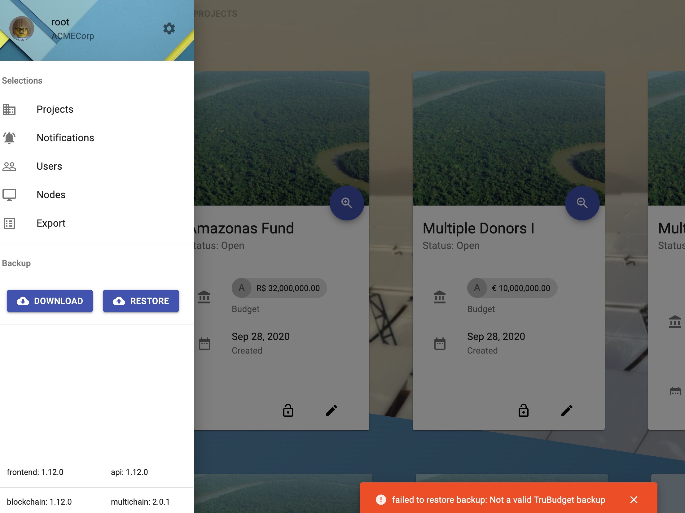

# Introduction

This tutorial explains which functions Trubudget has and how they work.
The documentation is organized in following sections:

## Users/Groups

Learn how to create Users/Groups and how or when they are notified.

- [User](./users-and-groups/user.md)
- [Group](./users-and-groups/group.md)
- [Notifications](./notifications.md)

## Permissions

Learn which permissions exist in Trubudget and how to grant/revoke them.

- [Permissions](./users-and-groups/permissions.md)

## Projects

Learn how to create and work with projects and their components.

- [Project](./projects/project.md)
- [Subproject](./projects/subproject.md)
- [Workflow](./projects/workflowitem.md)

## Network

Learn how to approve other organizations or nodes to expand your Trubudget network.

- [Nodes](./network/nodes.md)

## Backups

Learn how to download or upload a backup of the current data (multichain instance) as a _root_ user.

- [Backup](./backup.md)

## Versions and Service-Status

Learn where to find the versions and connection quality of all Trubudget components

- [Service-Status](./status/status.md)

## FAQ

### I have started TruBudget without provisioning. What are the default login credentials?

The default user for TruBudget is the root user. The following are the credentials.

```
Username  |  Password
------------------------
root      |  root-secret
```

> Default password can be changed via the environment variable ROOT_SECRET.

### How can I change the default project background images?

Changing these images is only possible by replacing the Thumbnail\_\*.jpg files in the `frontend/public` folder.

**Notes:**

Changes are only applied after restarting the frontend.
Filenames `Thumbnail_0001.jpg` - `Thumbnail_0024.jpg` have to stay the same.
`Thumbnail_0025.jpg` and above are ignored.

### Where to find the used illustration images for the empty fields or tables?

The source of illustration images is [unDraw](https://undraw.co/illustrations) with color code #53BBFE selected

### What should I do if I get an error when I try to restore a backup?

This might happen because the backup.gz file you are trying to restore contains an invalid hash.
If the error that occurs is "Failed to restore backup: Not a valid TruBudget backup" and it looks similar to the picture below, there is a script that can fix the hash. However, only use it if you are certain that your backup is a valid TruBudget backup.



To run the script please follow the instructions below:

1. Navigate to the `/blockchain` folder and open your favorite shell
1. Type `npm run check_backup` and add the path to the backup.gz file you want to fix (e.g. `npm run check_backup -- "path/to/backup.gz"`)
1. The script will print out the result of the check which tells you if the backup is valid or not.
1. Optionally, type -f/--fix after the path. This option will also fix the hash if it is invalid. A new file `backup updated.gz` will be created in the same location as the one you provided. It is an exact copy of your backup, but with a corrected hash
1. You can now use this file to restore your backup

- Note that if your filename contains a blank space (e.g. `backup (1).gz`), you should use quotation marks when entering the path, so it will be recognized as one argument and not two separate ones.
