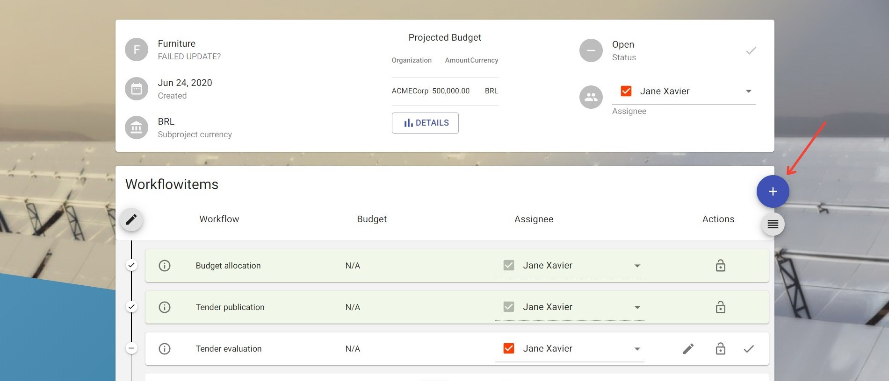
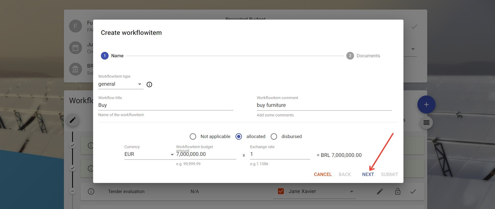
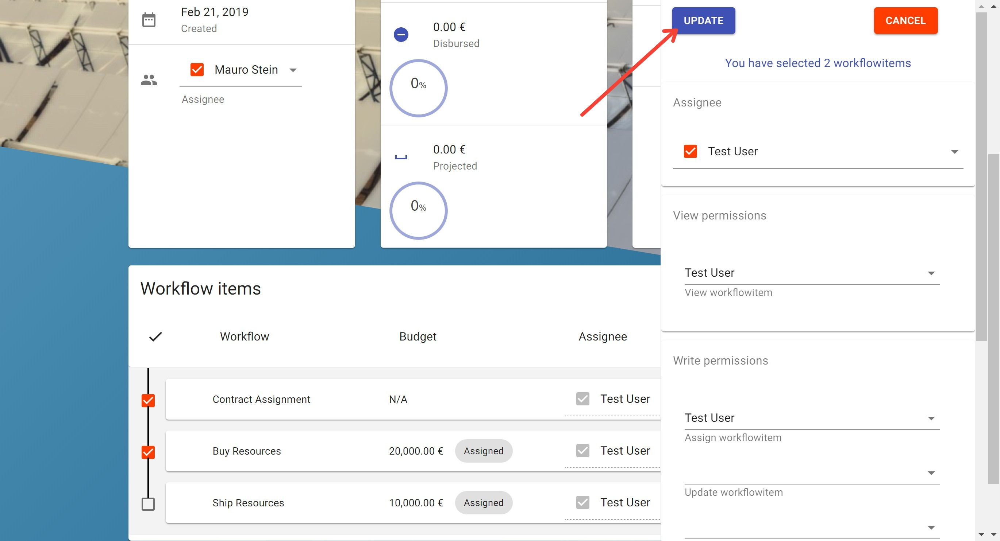
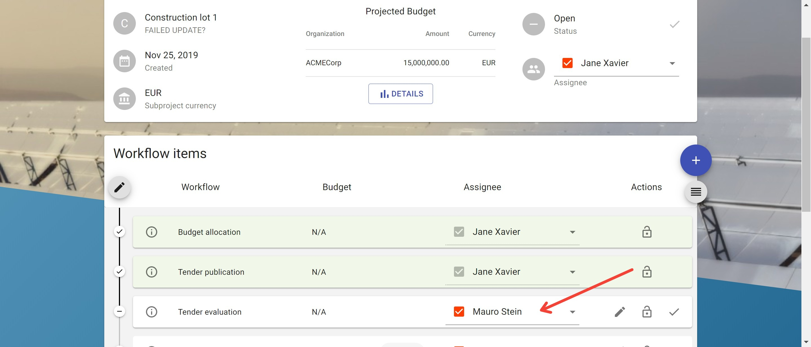
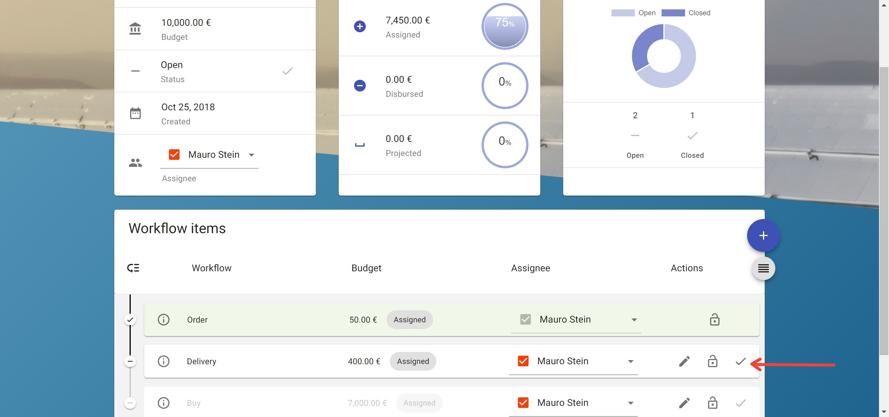
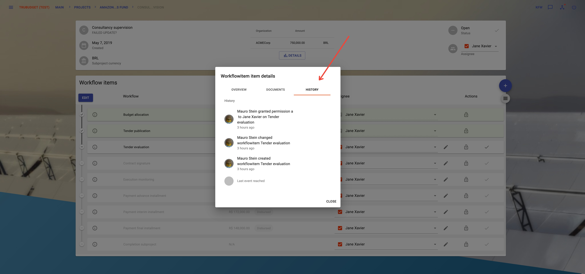
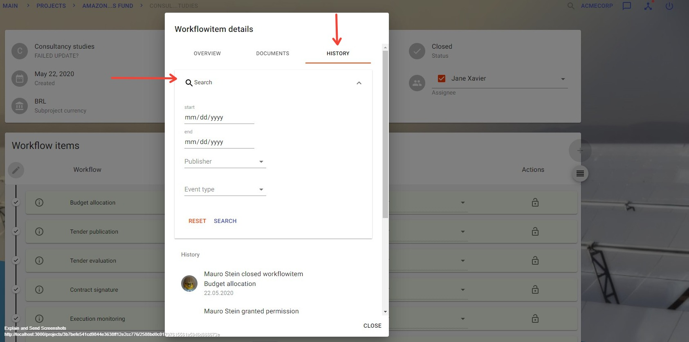
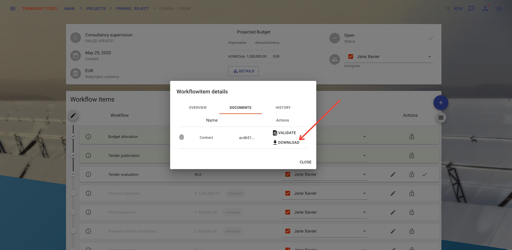
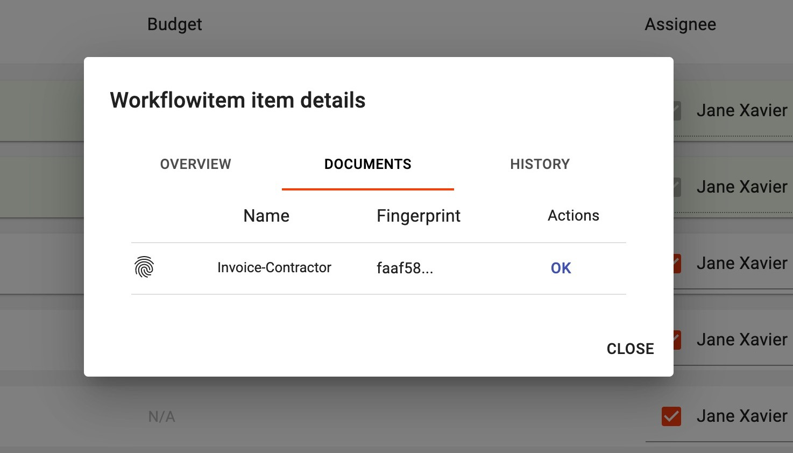

# Workflowitems

- [Workflowitems](#workflowitems)
  - [View workflowitems](#view-workflowitems)
  - [View workflowitem details](#view-workflowitem-details)
  - [Create a workflowitem](#create-a-workflowitem)
  - [Update a workflowitem](#update-a-workflowitem)
  - [Update multiple workflowitems](#update-multiple-workflowitems)
  - [Assign an User/Group to a workflowitem](#assign-an-usergroup-to-a-workflowitem)
  - [Close workflowitem](#close-workflowitem)
  - [View and filter the history of a workflowitem](#view-and-filter-the-history-of-a-workflowitem)
  - [Reorder Workflowitems](#reorder-workflowitems)
  - [Documents in TruBudget](#documents-in-trubudget)
    - [Add document to workflowitem](#add-document-to-workflowitem)
    - [Download document from workflowitem (Since Trubudget-v1.10.0)](#download-document-from-workflowitem-since-trubudget-v1100)
    - [Validate a document](#validate-a-document)

Workflowitems are the lowest level of abstraction in TruBudget. Workflowitems are steps/task that need to be fulfilled to mark a suproject as done, like Budget allocation, Tender publication, Contract signature, Payment final installment,..

There are some different permissions which affect workflowitems.

- workflowitem.intent.listPermissions
- workflowitem.intent.grantPermission
- workflowitem.intent.revokePermission
- workflowitem.view
- workflowitem.assign
- workflowitem.update

More details about the permission model can be found in the [Permissions section](../users-and-groups/permissions.md).

## View workflowitems

**Description:**

View all workflowitems of the current subproject.

**Instructions:**

1. Click the button in the upper left corner to open the side-navigation-bar
2. Click the "Projects" menu point
3. Click the blue magnifier icon in the bottom right corner of a project
4. Click the grey magnifier icon on the most right of the subproject you want to view
5. At the bottom half of the site all workflowitems of the current subproject are viewed.

:::note
Workflowitems are viewed as redacted if the user has no permission to view it.

:::

## View workflowitem details

**Description:**

View details like budget or task status of a subproject.

**Instructions:**

1. Click the button in the upper left corner to open the side-navigation-bar
2. Click the "Projects" menu point
3. Click the blue magnifier icon in the bottom right corner of a project
4. Click the grey magnifier icon on the most right of the subproject
5. Click the info icon on the left side of the workflowitem's title to open the info dialog

6. [Optional] Click the "validate"-button to select a document which should be compared with the uploaded one.
7. [Optional] Depending on the document validation the validate icon shows "OK" or "NOT OK"

:::note

- Most of the details are shown in the workflowitems-list on the subprojects overview.
- It is possible to validate if an uploaded document is the same the user has locally.

:::

## Create a workflowitem

**Description:**

Create a new workflowitem defining title, comment, currency and budget. It is also possible to attach documents to the workflowitem.

**Instructions:**

1. Click the button in the upper left corner to open the side-navigation-bar
2. Click the "Projects" menu point
3. Click the blue magnifier icon in the bottom right corner of a project
4. Click the grey magnifier icon on the most right of the subproject you want to view
5. Click the '+' button on the right to open the creation dialog

6. Fill in the required fields:

   - Workflowitem type: Workflowitems behave differently according to their type
     - general: A workflowitem of type general will be created
     - restricted: When assigning a restricted workflowitem permissions are automatically granted and revoked. The assigner will only keep the view permissions.
   - "Workflow Title": Title of the workflowitem
   - "Comment": A little description or comment refering to the workflowitem
   - Budget:
     - Not applicable: The workflowitem does not affect the budget of the subproject
     - allocated: The workflowitem will affect the budget of the subproject but the budget is not disbursed yet
     - disbursed: The workflowitem affect the budget of the subproject
   - "Currency": Currency of the workflowitem
   - "Workflow budget amount": Assigned budget to the workflowitem

7. [Optional] Click the "Next"-button to switch to the next dialog where documents can be uploaded
8. [Optional] Fill in the required fields:
   - "Document Name": A unique name of the document
9. [Optional] Click the "Upload"-button to open the file selector.

10. [Optional] Select the document which should be uploaded
11. [Optional] All documents can now be seen above the input field
12. Click the "Submit"-button to create a new workflowitem

:::note

- The root user may not create workflowitems.
- Do not forget to permit other users to view/edit the newly created workflowitem.
- It is possible to add more than one documents to a workflowitem.
- It is not possible to remove/delete documents.

:::

## Update a workflowitem

**Description:**

Update details like title, comment, currency and budget of a workflowitem. It is also possible to attach documents to the workflowitem.

**Instructions:**

1. Click the button in the upper left corner to open the side-navigation-bar
2. Click the "Projects" menu point
3. Click the blue magnifier icon in the bottom right corner of a project
4. Click the grey magnifier icon on the most right of the subproject you want to view
5. Click the pen icon next to the assignee field of the worklfowitem which shall be updated
6. Fill in the fields that shall be updated:

   - "Workflow Title": Title of the workflowitem
   - "Comment": A little description or comment refering to the workflowitem
   - Budget:
     - Not applicable: The workflowitem does not affect the budget of the subproject
     - allocated: The workflowitem will affect the budget of the subproject but the budget is not disbursed yet
     - disbursed: The workflowitem affect the budget of the subproject
   - "Currency": Currency of the workflowitem
   - "Workflow budget amount": Assigned budget to the workflowitem

7. [Optional] Click the "Next"-button to switch to the next dialog where documents can be uploaded
8. [Optional] Fill in the required fields:
   - "Document Name": A unique name of the document
9. [Optional] Click the "Upload"-button to open thge file selector.
10. [Optional] Select the document which should be uploaded
11. [Optional] All documents can now be seen above the input field
12. Click the "Submit"-button to update the workflowitem

:::note

- The pen icon can only be viewed if the current user has update permissions.
- The pen icon disappear if the workflowitem is closed
- It is not possible to remove/delete documents.

:::

## Update multiple workflowitems

**Description:**

Update assignee or workflowitem-permissions for multiple workflowitems at once.

**Instructions:**

1. Click the button in the upper left corner to open the side-navigation-bar
2. Click the "Projects" menu point
3. Click the blue magnifier icon in the bottom right corner of a project
4. Click the grey magnifier icon on the most right of the subproject you want to view
5. Click the "Edit"-button on the left above the workflowitems-list to switch into "Edit"-mode

6. Select the workflowitems which should be edited by checking the checkboxes to the left of each workflowitem
7. By selecting one or more workflowitems a side menu opens to the right
8. [Optional] Click the assignee dropdown field to open a selection where the right user or group can be selected
9. [Optional] Click on one permission dropdown field to open a selection where the right user or group can be selected
10. Click the "Update"-button at the top of the side menu to open a preview of all actions the update will trigger. Actions are differientiated between "possible" and "not possible" actions. "Not possible" actions are assign intents on closed workflowitems only.

11. Click on "Submit" to start the update process, which can be followed by the preview

12. Click on "Done" to close the dialog and exit "edit"-mode

:::note

- Only assignee or permissions can be updated at once.
- Permissions of identities that are not selected except the one of the current user are revoked during the process
- "Not possible" actions are assign intents on closed workflowitems only.

:::

## Assign an User/Group to a workflowitem

**Description:**

Assign a User or Group to a workflowitem to show which User or Group is responsible for it.

**Instructions:**

1. Click the button in the upper left corner to open the side-navigation-bar
2. Click the "Projects" menu point
3. Click the blue magnifier icon in the bottom right corner of a project
4. Click the grey magnifier icon on the most right of the subproject you want to view
5. Click the assignee dropdown field of a workflowitem in the bottom list to open a selection
6. Select and click on an user or group to open a [confirmation dialog](../confirmation.md)
7. In case the assigner has no project view permissions the user or group cannot be assigned
8. Confirming the dialog first executes all additional actions listed if there are any, then assigns the user
9. If no addtional permissions have to be granted the user or group is assigned

:::note

- Assigning a user/group needs project, subproject and workflowitem view permissions.
- If the assignee has not all necessary view permissions yet a dialog opens which shows all required permissions.
  On confirm they can be granted if the assigner has grant permissions. (see [confirmation](../confirmation.md) for more Details)

:::

## Close workflowitem

**Description:**

Close a workflowitem when the work is done.

**Instructions:**

1. Click the button in the upper left corner to open the side-navigation-bar
2. Click the "Projects" menu point
3. Click the blue magnifier icon in the bottom right corner of a project
4. Click the grey magnifier icon on the most right of the subproject
5. Click the done-button on the most right of the workflowitem you want to close

:::note

- Workflowitems can only be closed one after eachother.
- A workflowitem can only be closed if the user is assigned.
  :::

## View and filter the history of a workflowitem

**Description:**

The history for each workflowitem can be found in its details dialog. The history contains a chronological list of changes of the selected workflowitem, starting with the newest.
The entries in the history can be filtered by 4 different values: publisher, type of event, a start date and a end date, where a timeframe can be determined. By clicking the search button, all values that are specified are used in the filter request.

**Instructions:**

1. Click on the "i" (information) button of the workflowitem to [view the workflowitem details](#view-workflowitem-details)
   
2. Navigate to the "History" tab
   
3. You can now view the history of the selected workflowitem
4. To filter the history events, click on the expandable filter area and set the filter options
   

## Reorder Workflowitems

**Description:**

If workflowitems are not closed or redacted( user has no view permission) the user can reorder them.

**Instructions:**

1. Click the button in the upper left corner to open the side-navigation-bar
2. Click the "Projects" menu point
3. Click the blue magnifier icon in the bottom right corner of a project
4. Click the grey magnifier icon on the most right of the subproject
5. Click the "edit"-button on the left above the workflowitems-list to switch into "edit"-mode

6. Click and pull a workflowitem to the new position in the workflowitem queue
7. When finished reordering submit the change and exit "edit"-mode with a click on the "done"-icon at the same position the "edit" button has been before.

:::note

- If one or more workflowitems between the workflowitems the user want to reorder are redacted the user is not able to reorder.
- Do not forget to submit the new order with a click on the "done"-icon above the workflowitems-list
- In "edit"-mode it is not possible to click a button located on a workflowitem
- In "edit"-mode workflowitems are selectable in order to update more than one workflowitem at the same time

:::

## Documents in TruBudget

**Description:**

TruBudget features upload/download and validation of documents. If a file (like a contract, invoice, etc.) is part of the general workflow of a subproject, the document can be added to a workflowitem and later be downloaded or validated by another user. Before `Trubudget-v1.10.0` a document is not uploaded itself - instead only a computed fingerprint is stored on the blockchain. When another user validates the document, the fingerprint of his/her copy is calculated and compared to the original. Since `Trubdget-v1.10.0` a documents can be uploaded and downloaded.

### Add document to workflowitem

Adding a document to a workflowitem can be done either when adding or when creating the document, in the second screen.

1. Either [create a new workflowitem](#create-a-workflowitem) or [update an existing workflowitem](#update-a-workflowitem)
2. After filling out the fields on the first page, click the "Next" button
3. In the second screen, enter a name for the document. This name does not have to be the same as the filename! The name should be descriptive of the document that is being uploaded, e.g. "Invoice-Contractor" or "Contract-School". After typing a name, the button "Upload" gets activated
4. Click the "Upload" button and select a file from your device
   
5. Click the "Submit" button to finish

### Download document from workflowitem (Since Trubudget-v1.10.0)

1. Click on the "i" (information) button of the workflowitem containing the document to [view the workflowitem details](#view-workflowitem-details)
   
2. Navigate to the "Documents" tab
   
3. If you see the desired document, click the "Download" button
   

### Validate a document

1. Click on the "i" (information) button of the workflowitem containing the document to [view the workflowitem details](#view-workflowitem-details)
   
2. Navigate to the "Documents" tab
   
3. If you see the desired document, click the "Validate" button
   
4. Select the correct document from your drive
5. If the documents match, the validation says "OK"
   
6. [Optional] If the documents do not match, the label changes to "NOT OK". Click on the "NOT OK" button and choose another document to try again.
